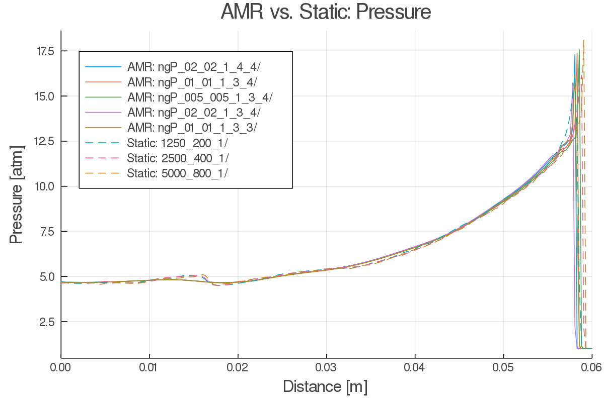

# Detonation Modeling in OpenFOAM Using Adaptive Mesh Refinement
**By Duncan A. McGough**

University of Colorado Boulder Aerospace Engineering Sciences MS Thesis. 

--- 
## Abstract

This thesis contains research performed on detonation modeling in OpenFOAM, an open-source computational fluid dynamics toolbox. Several existing solvers are tested for their ability to capture shocks and model reactions needed for detonations. It is shown that the central-upwind-scheme-based solvers better capture sharp flow features with shocks, a necessity for high-speed reacting flow simulations. Automatic time stepping algorithms are examined, tracking both the central and acoustic Courant numbers. Lower than typical Courant numbers for supersonic nonreacting flows are found to be required for solution convergence and noise reduction. The  pre-exponential factor in the Arrhenius rate equation is explored to determine the sensitivity on the solution as well as compare to published values for single-step Arrhenius hydrogen-air combustion. Static one- and two-dimensional meshes were compared, and separate convergence criteria for resolving the detonation wave shape as a whole as well as fine detonation structure were seen. Adaptive mesh refinement (AMR), a type of runtime-active mesh generation that refines the mesh in regions of the domain that need it, is explored to determine if AMR can be used to decrease computational cost of detonation modeling for PDEs and RDEs within OpenFOAM. The normalized pressure gradient is tracked and used to direct where adaptive meshing should occur, and different values of normalized pressure gradient for when adaptive meshing should refine and unrefine the computational domain are examined. Effects of refinement level and the number of buffer layers between refined and unrefined layers are explored in context of both solution accuracy as well as computational cost. It was found that good reproduction of two-dimensional detonation waves formed with static computational grids can be done with adaptive meshing routines in OpenFOAM. Computational cost reductions of over 96% were seen with AMR.

---
## Thesis Document and Presentation

My document can be found here: [Thesis Document](./doc/McGoughThesis.pdf)

My defense presentation can be found here: [Defense Presentation](./doc/presentation/McGoughPresentation.pdf)

---
### Select Images

#### Adaptive meshing of detonation wave

#### Formation of detonation cells

#### Pressure surface plot

#### AMR vs. static mesh 

*AMR legend:* [AMR-tracking field variable]-[field unrefine low bound]-[field refine low bound]-[field refine upper bound]-[AMR buffer layers]-[AMR refinement levels]

*Mesh legend:* [cells in x]-[cells in y]-[cells in z]

---

## Publication Information

TBA